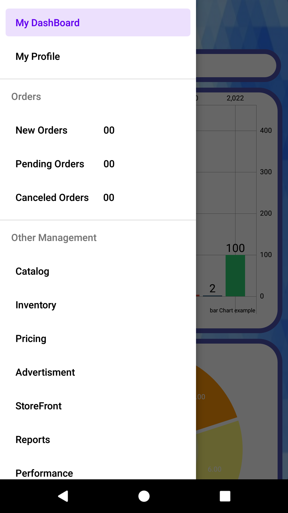
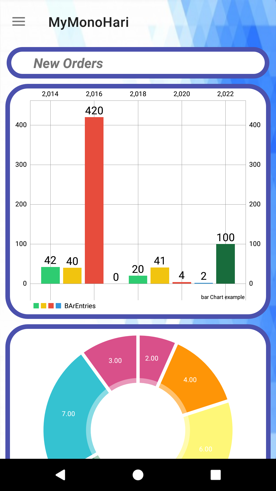
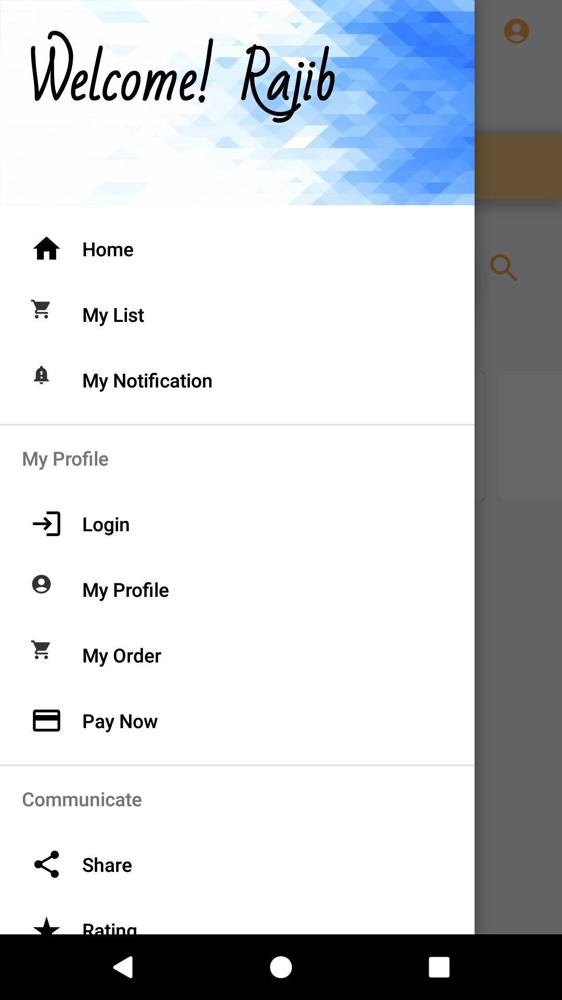
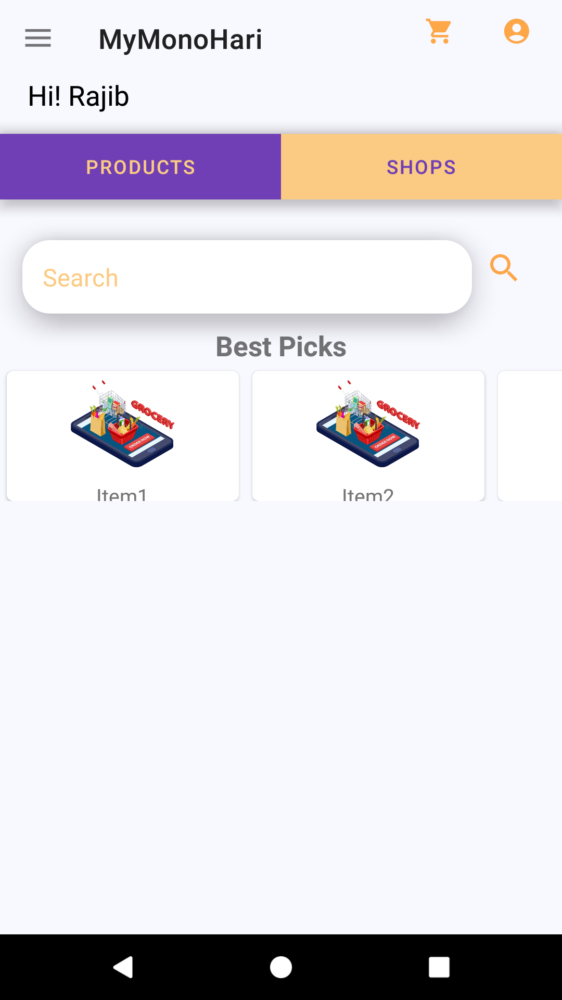
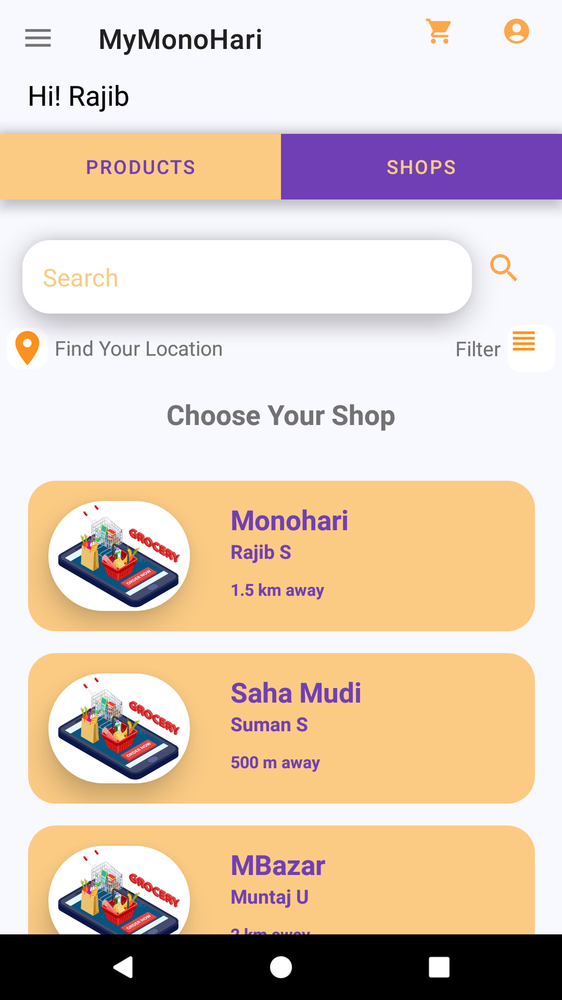
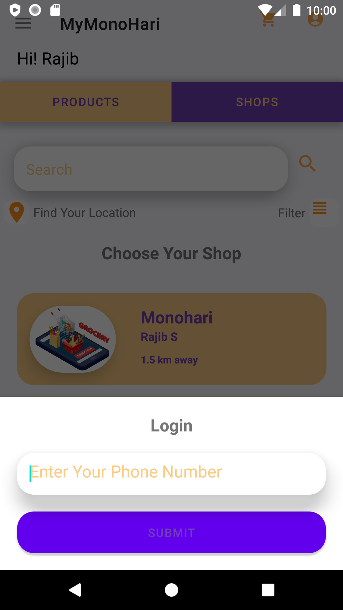

<link rel="stylesheet" type="text/css" href="README.css" />

# Introduction
**MonoHari** is an online grocery delivery application solution for local stores , where grocery shop owners can turn **their local business into an online delivery business.**
# Working Goal
Our application will be **connecting all local grocery shops** of a place, **listing their products on the application dashboard.**
From **dashboard customers** can place an **order** according to their needs.
# Motivation of This work
In this pandemic, when all people have to maintain social distancing and perform Covid 19 norms, our application is giving a solution to those local shop owner who have been affected really worst. This solution can help customers getting their essential commodities without going outside of their home and as well as give an opportunity to small grocery shopkeepers to sustain their business. A win-win solution for all.

# Job is done here
Creating The Dashboard

<table>
<tr>
<td></td>
<td></td>

  </tr>
  <tr>
<td>Vendor Navigation Bar</td>
<td>Vendor DashBoard </td>
</tr>
  <tr>
<td></td>
<td></td>
<td></td>
<td></td>
</tr>
  <tr>
<td>customer Navigation Bar</td>
<td>customer DashBoard </td>
<td>customer DashBoard</td>
<td>customer Login </td>
</tr>

</table>

